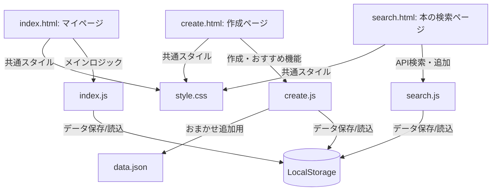

# HolidayLog (ホリデーログ) 実装計画

ユーザー様の選択に基づき、複数ページ（マルチページ）構成、Google Books API連携、タグ選択式、および「おまかせ追加」機能を組み込んだ「HolidayLog」の開発計画を策定しました。

## 構成・ファイル設計

マルチページ構成で動作を安定させ、JavaScriptの動作不具合（他ページのDOMが存在しないことによるエラー）を防ぐため、HTMLごとに個別のJSファイルを割り当てます。

---

## 提案される変更点

### 1. 共通デザインシステム
#### [NEW] [style.css](制作課題/style.css)
* **テーマ**: 深いブルーや鮮やかなグラデーション（例：パープルからコーラル）を取り入れたダーク/ライトの調和した極上モダンデザイン。
* 共通ナビゲーションバー（マイページ / 手動追加 / 本を検索）を全ページに配置。
* モバイル表示にも完全対応したレスポンシブなカードグリッドレイアウト。

---

### 2. マイページ（一覧画面）
#### [NEW] [index.html](制作課題/index.html)
* 保存されたアイテム（LocalStorage）を一覧表示するメイン画面。
* タグ（「本」「映画」「カフェ」「その他」）や状態（「読みたい・行きたい(todo)」「読んだ・行った(done)」）によるフィルタリングタブ。
* 保存データがない場合の「まだリストはありません」というプレースホルダー表示。

#### [NEW] [index.js](制作課題/index.js)
* LocalStorageからのデータの読み込みと描画。
* トグルスイッチによる `status` (todo/done) のリアルタイム更新。
* 削除ボタンによる個別アイテムの削除。
* キーワード検索（タイトルやメモの部分一致検索）。

---

### 3. 作成（手動登録 ＆ おまかせ追加）ページ
#### [NEW] [create.html](制作課題/create.html)
* **手動登録フォーム**:
  * タイトル入力
  * タグ選択（セレクトボックス：「本」「映画」「カフェ」「その他」）
  * URL入力
  * 優先度選択（1〜5段階評価の星評価または数値選択）
  * 一言メモ
* **おまかせ追加セクション**:
  * 「何をするか迷ったら？」ボタンを押すと、おすすめテンプレートからランダムに1件選択され、手動入力フォームに自動入力される（または直接マイページに追加される）。

#### [NEW] [create.js](制作課題/create.js)
* フォームの入力バリデーション（空文字チェック、URL形式チェックなど）。
* `data.json` からおすすめテンプレートを非同期に `fetch` する機能。
* 重複チェック（すでに同じタイトルのアイテムがLocalStorageにあれば警告）。
* 保存完了時にトーストUIで視覚的にユーザーにフィードバック。

#### [NEW] [data.json](制作課題/data.json)
* おまかせ追加用のサンプルテンプレートデータ（書籍、カフェ、映画などを各2件ずつ合計6件程度記述）。

---

### 4. 本の検索ページ（Google Books API連携）
#### [NEW] [search.html](制作課題/search.html)
* Google Books APIから本を検索するための検索窓。
* 検索実行中のローディングスピナーアニメーション。
* 検索結果カード（本の表紙画像、タイトル、著者名、発行日、「マイ・バックログに追加」ボタン）。

#### [NEW] [search.js](制作課題/search.js)
* Google Books API (`https://www.googleapis.com/books/v1/volumes?q=検索キー`) への非同期Fetchリクエスト。
* APIから取得したデータのパース（画像や著者がない場合の代替デフォルト値の設定）。
* 「バックログに追加」ボタンで、自動的にタグを「本」、ステータスを「todo」としてLocalStorageに保存。
* すでに追加済みの本には「追加済み」ラベルを表示（重複チェック）。

---

## オープンな質問（ユーザー確認事項）

> [!NOTE]
> 実装を開始する前に、以下の点についてご希望があればお知らせください。
>
> 1. **おまかせ追加用のおすすめデータ (`data.json`) の内容**:
>    どのような「本」「映画」「カフェ」が入っていると嬉しいですか？（特になければ、こちらで「名作小説」「話題の映画」「素敵なコンセプトカフェ」などのダミーデータをあらかじめいくつか設定します！）
> 
> 2. **優先度（星評価）の入力・表示方法**:
>    優先度（⭐1〜5）の入力はどうしたいですか？
>    * クリックで⭐が増減するインタラクティブなUI
>    * セレクトボックス（`⭐⭐⭐⭐⭐`の選択肢）によるシンプルなUI（おすすめ 👍）

---

## 検証プラン

### 1. 動作確認
* `search.html` で「ハリーポッター」などの本を検索し、正しい結果が表示されるか。
* 検索結果から「バックログに追加」を押して、`index.html`（マイページ）に正しいデータが追加されているか。
* `create.html` で手動で「カフェ」を追加し、登録できるか。「おまかせ追加」がランダムに正常機能するか。

### 2. UI/UXテスト
* モバイル表示（レスポンシブ）で各ページのデザインが崩れないか。
* アイテムを完了（todo ➡️ done）にトグルした際、表示が即時に更新されるか。
